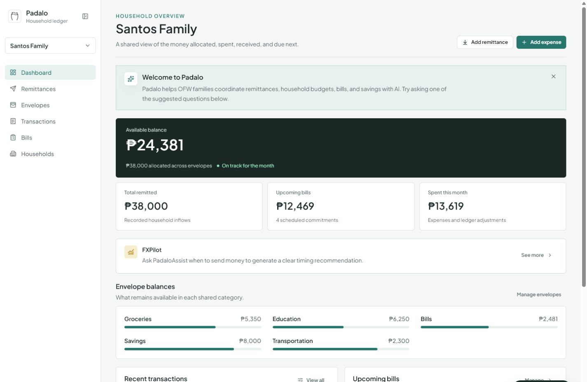
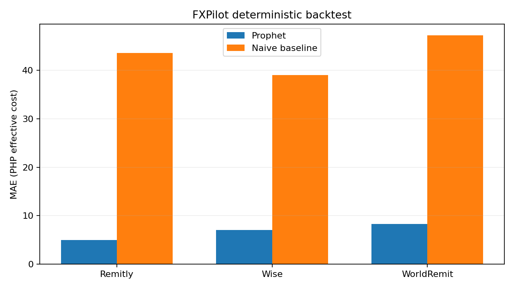
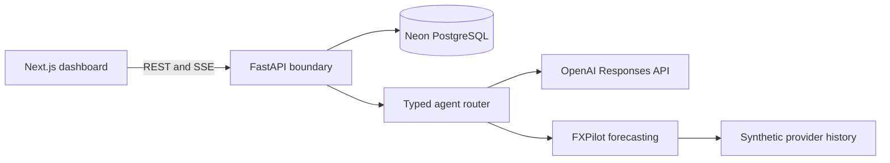

# Padalo

> Shared household finance for OFW families, with transparent AI guidance and a provider-behavior
> forecasting companion called FXPilot.


<p align="center">
  
</p>

Padalo gives an Overseas Filipino Worker and their family one calm, shared picture of remittances,
envelopes, expenses, bills, and savings. It is designed to support conversation and coordination,
not surveillance or blame.

**[Open the local demo](http://localhost:3000)** | [Demo script](docs/demo-script.md) |
[Architecture](docs/architecture.md) | [Deployment](docs/deployment.md)

## Why Padalo

Maria sends money from Dubai. Ana and Jose coordinate household needs in Quezon City. The difficult
part is rarely just sending money: it is maintaining shared context around what arrived, what was
spent, what remains, and what needs attention next.

Padalo turns that fragmented conversation into a neutral household workspace. FXPilot complements
that picture with a transparent timing estimate based on modeled provider behavior, not speculative
foreign-exchange trading.

## Features

- Shared household ledger for envelopes, transactions, remittances, and recurring bills.
- Deterministic Santos Family demo with realistic household activity and commitments.
- Responsive Next.js dashboard with loading, empty, error, optimistic, and accessible states.
- OpenAI Responses API agent with strict function schemas, typed tool routing, structured outputs,
  streaming, retry handling, and bounded household-scoped memory.
- Visible tool-progress timeline so the family can see what context is being reviewed.
- FXPilot Prophet forecasts per provider, with Philippine holidays, payday/promo effects, uncertainty
  intervals, a naive baseline, and a visible synthetic-data disclaimer.
- Opt-in Demo Mode that reseeds only the Santos Family household, clears the browser conversation,
  and restores the original dashboard state.

## Product Screens

| Santos Family dashboard                                                       | FXPilot backtest                                                                              |
| ----------------------------------------------------------------------------- | --------------------------------------------------------------------------------------------- |
|  |  |

The dashboard screenshot is captured from the current deterministic Santos Family demo. The backtest
chart is generated from the versioned synthetic provider history and is intentionally retained alongside
its baseline comparison.

## Architecture



The model never receives a database session, repository, connection string, or SQL. It can only use
typed tools, whose inputs are validated before they reach existing services. Complete system, agent,
forecast, and database diagrams live in [docs/architecture.md](docs/architecture.md).

## AI Architecture

1. The dashboard opens the existing household-scoped SSE endpoint.
2. FastAPI loads bounded memory and gives the Responses API a trust-sensitive system prompt plus
   strict JSON function schemas.
3. The agent selects a typed tool such as `get_budget_status`, `upcoming_bills`,
   `search_transactions`, `log_expense`, `create_remittance`, or `forecast_remittance`.
4. The tool router validates arguments with Pydantic, invokes a scoped callback, and returns typed
   JSON to the model.
5. The browser receives validated progress, result, error, delta, and final events. It updates the
   FXPilot card from the existing tool result without changing the SSE contract.

The UI never presents a tool as complete until it receives its matching result, and agent failures
offer a calm retry action.

## FXPilot

FXPilot predicts **provider behavior patterns**, not a tradable exchange rate. It trains Prophet
models independently for Wise, Remitly, and WorldRemit on deterministic AE-PH synthetic data with:

- Weekly seasonality and custom Philippine holidays.
- Known payday and scheduled promotion regressors.
- An 80% uncertainty interval and reproducible seed `20260717`.
- A 56-day holdout compared against a naive same-weekday baseline.

| Provider   | Prophet MAE | Baseline MAE | Preferred |
| ---------- | ----------: | -----------: | --------- |
| Remitly    |    4.96 PHP |    43.56 PHP | Prophet   |
| Wise       |    7.02 PHP |    39.05 PHP | Prophet   |
| WorldRemit |    8.32 PHP |    47.22 PHP | Prophet   |

These metrics validate the deterministic synthetic process, not real-world provider accuracy. Every
forecast says so. Read the full data, model, evaluation, and real-data migration plan in
[docs/fxpilot.md](docs/fxpilot.md).

## Quick Start

### Prerequisites

- Node.js 20+ and npm 10+
- Python 3.11+
- Neon PostgreSQL or local Postgres for persistent, production-like data
- An OpenAI API key for the live agent demo
- Docker Desktop, optional

### Setup

```bash
npm install
python -m venv apps/api/.venv
source apps/api/.venv/bin/activate
python -m pip install -r apps/api/requirements-dev.txt
cp .env.example .env
cp apps/web/.env.local.example apps/web/.env.local
cp apps/api/.env.example apps/api/.env
```

Windows PowerShell:

```powershell
npm install
py -3.11 -m venv apps/api/.venv
apps\api\.venv\Scripts\python.exe -m pip install -r apps/api/requirements-dev.txt
Copy-Item .env.example .env
Copy-Item apps/web/.env.local.example apps/web/.env.local
Copy-Item apps/api/.env.example apps/api/.env
```

For the fastest Santos Family walkthrough, no database configuration is required. With an empty
`DATABASE_URL`, the FastAPI development server creates a local SQLite database and restores the
deterministic Santos Family records every time it starts:

```bash
npm run demo
```

Windows PowerShell without activating the virtual environment:

```powershell
npm run demo:win
```

To use Neon or local PostgreSQL instead, set `DATABASE_URL` in `apps/api/.env`, then initialize
the deterministic demo household before starting both services:

```bash
npm run db:migrate
npm run db:seed
npm run dev
```

Open these local URLs:

- Landing page: `http://localhost:3000`
- Santos Family demo: `http://localhost:3000/dashboard`
- FastAPI docs: `http://localhost:8000/docs`
- Health check: `http://localhost:8000/health`

`npm run dev:web` starts only Next.js. Use `npm run demo` or `npm run demo:win` whenever the
dashboard needs live ledger data.

## Demo Mode

Demo Mode is opt-in to keep operational reset behavior out of normal development and production.
For a local or judge deployment, set the same long random `DEMO_RESET_TOKEN` in the API and web
server environments, enable `DEMO_RESET_ENABLED=true` on FastAPI, and set
`NEXT_PUBLIC_DEMO_MODE=true` in the web app. The browser never receives the token.

The visible **Reset demo** control restores only the fixed Santos Family rows, clears browser-held
conversation state, restores the first-run welcome, and returns to `/dashboard`.

## Quality Checks

```bash
npm run lint
npm run typecheck
npm run format:check
npm run api:test
npm run forecast:test
npm run test:e2e
npm run build
```

On Windows without activating the API virtual environment:

```powershell
npm run api:test:win
npm run forecast:test:win
```

The Playwright check uses the local Chrome executable on Windows by default. On another platform,
install a Playwright browser or set `PLAYWRIGHT_CHROMIUM_EXECUTABLE`.

## Deployment

The intended stack is:

- **Vercel** for Next.js, using the committed `apps/web/vercel.json` workspace build.
- **Render** for the Dockerized FastAPI service, with `/health` configured as the HTTP health check.
- **Neon** for the production-like PostgreSQL database.

See [docs/deployment.md](docs/deployment.md) for environment variables, migration and seed order,
CORS configuration, Demo Mode safety, and deployed validation steps.

## Technical Decisions

| Decision                           | Why it matters                                                                   |
| ---------------------------------- | -------------------------------------------------------------------------------- |
| Next.js App Router + TypeScript    | Fast, responsive product and presentation surfaces in one web app.               |
| FastAPI + SQLAlchemy 2.0 + Alembic | Typed, testable ledger services with durable relational constraints.             |
| `household_members` + roles        | Makes room for users in more than one household without a future schema rewrite. |
| Typed agent package                | Prevents the LLM from directly reaching the database.                            |
| SSE                                | Exposes helpful, honest progress through long-running assistant turns.           |
| Prophet + baseline                 | Gives FXPilot a measurable timing model and keeps poor performance visible.      |
| Synthetic source disclaimer        | Avoids presenting demo behavior as a live provider quote or financial advice.    |

## Roadmap

| Phase                  | Status   |
| ---------------------- | -------- |
| 0. Foundations         | Complete |
| 0.5 Architecture Lock  | Complete |
| 1. Database Foundation | Complete |
| 2. Core Ledger API     | Complete |
| 3. Dashboard           | Complete |
| 4. Agent Layer         | Complete |
| 4.5 Demo Experience    | Complete |
| 5. FXPilot             | Complete |
| 6. Launch Readiness    | Complete |

## Documentation

- [Database schema and ERD](docs/database.md)
- [REST API contract](docs/api.md)
- [Frontend architecture](docs/frontend.md)
- [Agent and SSE contract](docs/agent.md)
- [Demo experience](docs/demo-experience.md)
- [FXPilot model](docs/fxpilot.md)
- [Architecture diagrams](docs/architecture.md)
- [Three-minute judge walkthrough](docs/demo-script.md)
- [Deployment checklist](docs/deployment.md)
- [Phase 6 QA checklist](docs/launch-readiness.md)

## Known Limitations

- No authentication or production identity verification.
- No real money movement or provider integration.
- FXPilot uses deterministic synthetic provider history, not live provider quotes.
- Conversation memory is intentionally in-process for the hackathon.
- Receipt parsing is not implemented.

## Acknowledgements

Built for OpenAI Build Week with Next.js, FastAPI, SQLAlchemy, Neon PostgreSQL, OpenAI Responses
API, Prophet, TanStack Query, React Hook Form, Zod, Tailwind CSS, Radix UI, Lucide, and Playwright.

Landing photography: [John Schnobrich on Unsplash](https://unsplash.com/@johnishappysometimes), used
under the [Unsplash License](https://unsplash.com/license).
