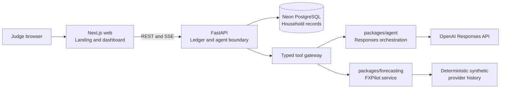
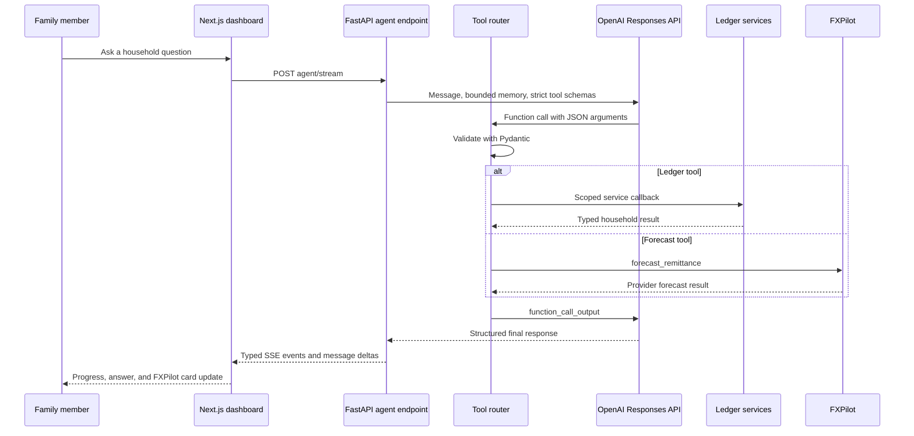
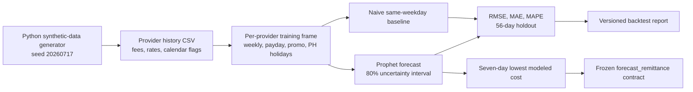
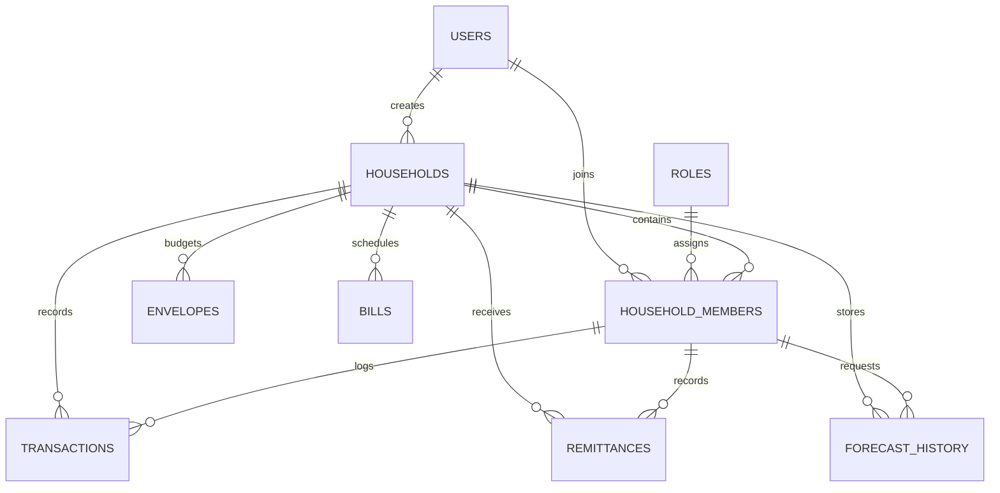

# Padalo Architecture

Padalo keeps the household ledger, agent orchestration, and forecasting engine separated so each
piece can be demonstrated and evaluated without giving the model direct access to financial records.

## System Architecture

The browser only talks to FastAPI through documented REST routes and the existing agent SSE stream.
The model receives typed tool definitions and tool output, never a database connection, SQL, or a
repository object.

## Agent Flow

## Forecast Pipeline

FXPilot forecasts modeled provider behavior, not a tradable foreign-exchange rate. Its public tool
output keeps the synthetic-data disclaimer intact and retains `is_mock: true` to describe demo-data
provenance, not a hard-coded implementation.

## Database Overview

`household_members` is the permission boundary. It lets a user belong to multiple households later
without changing the ledger schema, while system roles remain reusable and centrally defined.
