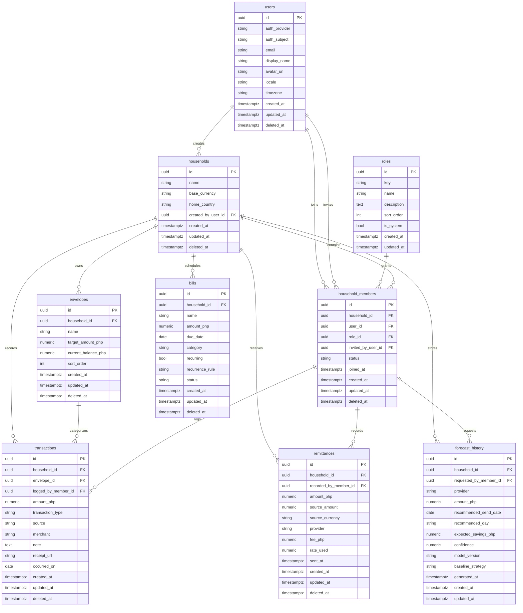

# Padalo Database Foundation

Phase 1 defines the relational foundation for Padalo. It intentionally contains schema, constraints, indexes, migrations, and seed data only. It does not implement authentication, CRUD endpoints, ledger calculations, AI tools, or forecasting behavior.

## ERD



## Architecture Decisions

- PostgreSQL is the target database.
- SQLAlchemy 2.0 declarative models are the Python ORM layer.
- Alembic owns schema migrations.
- Primary keys are UUIDs generated by PostgreSQL through `gen_random_uuid()` and by Python defaults in ORM usage.
- Naming conventions are centralized in `app.models.base`.
- Roles are rows in the `roles` table, not PostgreSQL enums.
- Membership is modeled through `household_members`, so one user can belong to multiple households.
- Financial records use `numeric`, not floating point values.
- `deleted_at` is used for soft delete on user-facing mutable records.

## Seed Data

Run after applying migrations:

```bash
cd apps/api
python -m scripts.seed
```

On Windows with the repo-local virtual environment:

```powershell
cd apps/api
.venv\Scripts\python.exe -m scripts.seed
```

The seed script inserts:

- system roles: `worker`, `family_member`, `coordinator`
- the Santos Family demo household
- Maria Santos, Ana Santos, and Jose Santos with worker, family-member, and coordinator memberships
- five envelopes: groceries, education, bills, savings, and transportation
- two AED remittances
- deterministic transactions for groceries, education, bills, transportation, and savings
- four upcoming bills: Meralco, Converge, Tuition, and Water District
- one placeholder forecast history row

The seed script is a deterministic demo reset. It deletes and recreates only the fixed Santos Family
household, including its cascading child records, then upserts its roles and users with deterministic
UUIDs and timestamps. It does not alter any other household. See [demo-experience.md](demo-experience.md)
for the scenario and judge walkthrough.

## Migration Commands

```bash
cd apps/api
alembic upgrade head
alembic downgrade base
```

On Windows with the repo-local virtual environment:

```powershell
cd apps/api
.venv\Scripts\alembic.exe upgrade head
```

`DATABASE_URL` must point to Neon or another PostgreSQL database before migrations or seeding can run.
